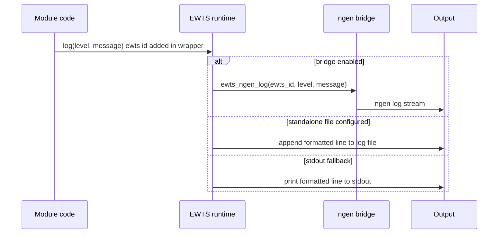
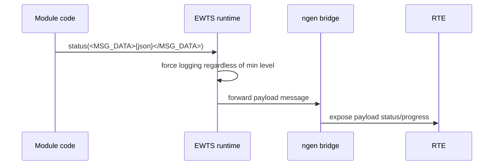

# Message Flow

## Standard log flow

## Payload log flow

## Filtering

| Level type | Filtered by minimum level? |
| --- | --- |
| DEBUG | Yes |
| PERFORM | Yes |
| INFO | Yes |
| WARNING | Yes |
| SEVERE | Yes |
| FATAL | Yes |
| STATUS | No |
