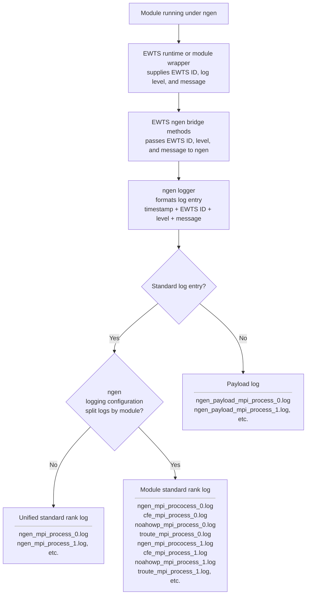

# Module Identity and Log Splitting

EWTS uses an **EWTS ID** to uniquely identify the module instance producing a log message during an `ngen` run. Examples include `CFE`, `TROUTE`, `SAC_SMA`, `SNOW17`, and `NOAHOWP`.

When a module writes through the EWTS bridge logger, the bridge passes the EWTS ID, log level, and message text to the `ngen` logger. The `ngen` logger formats the final log entry with a timestamp, EWTS ID, log level, and message, then writes it to the correct log file for the current MPI rank.

File placement is controlled by the `ngen` logging configuration and by whether the message is a standard log message or a payload status message.

## Runtime and integration identity

The EWTS language runtime libraries, the `ngen` integration code, and the `ngen` bridge library are related but separate pieces of the logging path.

| Component | Role | Uses EWTS ID for |
| --- | --- | --- |
| EWTS language runtime libraries | Provide Python, C, C++, and Fortran APIs used by module code. | Supplying the module-specific EWTS ID at the log call site or through a module wrapper. |
| `ngen` bridge library | Provides bridge methods used when modules are running under `ngen`. | Passing the caller's EWTS ID, log level, and message text into the `ngen` logger. |
| `ngen` integration | Connects EWTS bridge logging to `ngen` logging configuration and output files. | Routing standard log messages to either unified rank logs or module-named rank logs. |
| `ngen` logger | Formats and writes the final log record. | Including the EWTS ID in the formatted log entry and using it for split-by-module output selection. |

## Standard log routing

| Message type | Default behavior | With split logs by module |
| --- | --- | --- |
| Standard log messages | One unified standard log file per rank. | Per-rank, module-named standard log files selected by EWTS ID. |
| Payload log messages | One unified payload log file per rank. | Not split by module. |

The following diagram shows the standard log-message flow for one or more MPI ranks. The same routing decision is made independently by every MPI rank in the run.



## Default ngen log layout

By default, `ngen` writes a **single unified standard log file per MPI rank**. Standard log messages from all modules running in that rank are written into that rank's unified log file. The EWTS ID is included in each formatted log entry so the source module can still be identified.

| MPI rank | Default standard log file | Contents |
| --- | --- | --- |
| Rank 0 | `ngen_mpi_process_0.log` | Standard log messages from all modules running in rank 0. |
| Rank 1 | `ngen_mpi_process_1.log` | Standard log messages from all modules running in rank 1. |
| Rank N | `ngen_mpi_process_N.log` | Standard log messages from all modules running in rank N. |

Payload status messages are different. They are written to a **separate payload log file** and are not mixed into the standard log stream.

## Split logs by module

When the `ngen` logging configuration enables **split logs by module**, only the **standard log messages** are split into individual per-rank, module-named log files. The EWTS ID determines which module-named log file receives the formatted standard log entry.

Payload messages are **never split by module**. They continue to be written to the separate payload log file for the rank.

## Fortran visibility pattern

Fortran modules should keep imported EWTS symbols private and re-export only the local names used by the module. This avoids ambiguous symbol errors when multiple modules import EWTS constants.

```fortran
#ifdef SACSMA_USE_EWTS
  use logger, only: EWTS_STATUS
  use ewts_module_constants, only: EWTS_ID_SAC_SMA

  integer, parameter, public :: LOG_LEVEL_STATUS = EWTS_STATUS
  character(len=*), parameter, public :: MODULE_ID = EWTS_ID_SAC_SMA
#else
  integer, parameter, public :: LOG_LEVEL_STATUS = 60
  character(len=*), parameter, public :: MODULE_ID = "SAC_SMA"
#endif
```

## Practical guidance

| Need | Use |
| --- | --- |
| Identify which module produced a standard log message. | Use the EWTS ID in the formatted log record. |
| Keep all standard messages together by MPI rank. | Use the default `ngen` unified logging behavior. |
| Separate standard messages by module while preserving rank separation. | Enable split logs by module in the `ngen` logging configuration. |
| Understand why there are multiple similarly named log files. | Each MPI rank writes its own log files; the rank number distinguishes them. |
| Track payload progress or model status for RTE/status consumers. | Use payload status messages; they remain in the payload status log and are not split by module. |
| Avoid Fortran namespace collisions. | Import EWTS constants privately and re-export local module names. |
