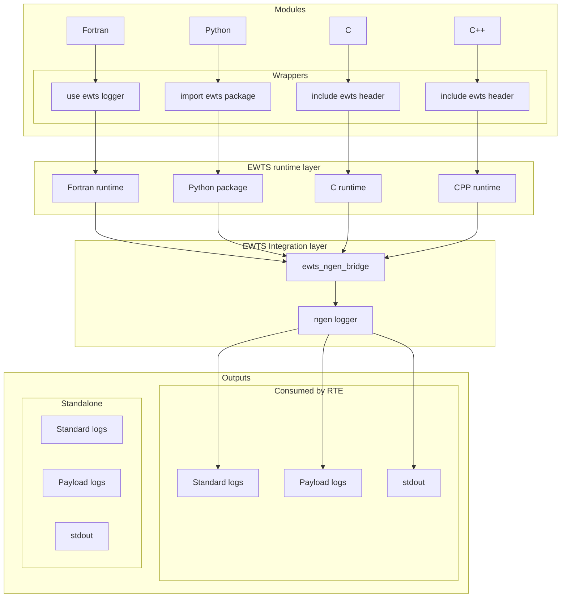

# Architecture Overview

EWTS is a layered logging system. Module code uses language-specific APIs and send their messages to ngen through the ewts ngen bridge methods. The ngen logger normalize levels, module IDs, and payload status conventions. At runtime, messages to the ngen bridge. If the bridge is unavailable, logs are written to standalone output.

## NGEN log usage and message flow

## Layer responsibilities

| Layer | Responsibilities |
| --- | --- |
| Modules | Calls the local EWTS API with module ID, level, and message. |
| Language runtime | Selects bridge or standalone output. |
| ngen bridge | Forwards messages into ngen logger to handle formatting and file I/O. |
| Output layers | Stores standard, payload and stdout logs for operational consumers. |
