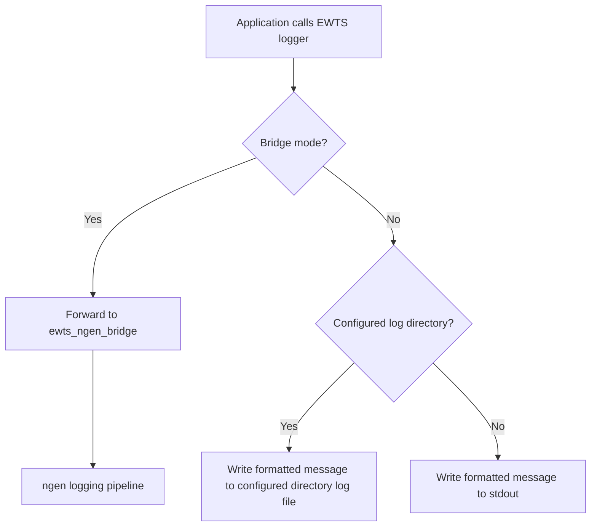

# Concepts

EWTS standardizes diagnostic logging and payload status reporting. It is intentionally small: stable log-level semantics, predictable output selection, and enough structure for ngenCERF and the RTE to observe progress without coupling module code directly to the orchestration layer.

## Core terms

| Term | Meaning |
| --- | --- |
| Module | A BMI-enabled software model that implements a hydrologic or hydraulic process for use by ngen. |
| Component | A software package that supports the preparation, execution, or post-processing of ngen simulations. |
| EWTS ID | Stable identifier for the module or component writing a message. |
| Runtime | Language-specific EWTS implementation used by modules and components. |
| Bridge | ngen-facing adapter that forwards EWTS messages to the ngen logger. |
| STATUS | Special log level used for structured payload messages. Consumed by the RTE. |
| Standard Log Message | Timestamp, module id, log level log message in human readable form. |
| Payload Log Message| JSON object emitted at STATUS level and wrapped in `<MSG_DATA>` tags for machine consumption. |
| Split by module | Ability to attribute standard messages to specific EWTS ID log file instead of a single unified log. |
| Standalone mode | Execution outside ngen where EWTS writes to a configured directory or stdout. |
| Configured | In standalone mode, if EWTS_LOG_DIR is set, logs are written to a timestamped log file in the specified directory. Standalone fallback is stdout.|
| RTE | Run Time Environment. The workflow management system used to execute and monitor ngen simulations across supported deployment environments, including developer workspaces, ngenCERF, and the Operataional Test Cluster. |

## Runtime behavior

## Design principles

| Principle | Implementation consequence |
| --- | --- |
| Same semantics across languages | Constants and status values are mirrored in Python, C/C++, and Fortran. |
| Low coupling | Modules emit Standard and Payload messages; bridge/ngen log handling remains outside module logic. |
| Safe fallback | Missing bridge or file path should not prevent a module from logging. |
| Explicit module identity | EWTS IDs allow messages to be grouped by module. |
