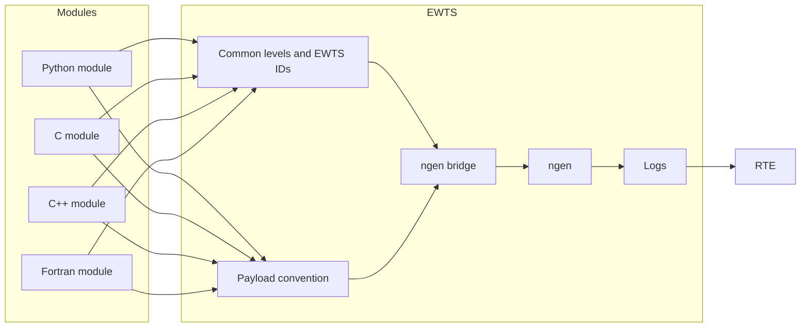

# Design Improvements

The EWTS was redesigned to address limitations identified in earlier logging implementations, particularly in multi-language and parallel execution environments. This section has been retained from Version 1.0 to document the architectural decisions that addressed those limitations and to preserve the rationale behind the current implementation.

### Safe and Configurable File Handling

Logging output is no longer tied to a single hardcoded path. Instead, EWTS
selects log locations based on the execution environment. When running under
`ngen`, log output is routed using integration-aware locations such as the
`ngen` results directory, currently defined by an enviroment variable. In 
standalone mode, EWTS also uses an enviroment variable when set, otherwise
falls back to stdout. This provides safer and more portable behavior across s
tandalone, scheduled, and integrated execution environments.

### Thread-Safe and Process-Safe Design

Previous implementations relied on global, unguarded buffers and shared state.
EWTS eliminates these patterns by:

- avoiding global mutable buffers
- using well-defined, scoped logging interfaces
- ensuring safe behavior across threads and processes

This prevents segmentation faults and undefined behavior caused by unsafe memory usage.

### Reliable String Handling

String construction and formatting are handled safely within each language-specific
Runtime Library, avoiding unsafe concatenation patterns and shared string state.
This ensures consistent and stable log message construction across all supported
languages.

### MPI-Aware Logging

EWTS is designed for parallel execution:

- each MPI rank writes to its own log file
- shared file writes are avoided
- log output remains deterministic and non-interleaved

This eliminates file I/O collisions and issues observed on distributed file systems
such as Lustre.

### Consistent and Robust Python Integration

The Python Runtime Library uses standard logging patterns and avoids overriding
core logging configuration in unsafe ways. Logging handlers are properly
initialized and attached, and file handling is managed to prevent descriptor leaks
and runtime errors.

### Centralized and Reusable Logging Behavior

Logging functionality is implemented once within the Runtime Libraries and reused
across modules and workflow components. This:

- eliminates duplicated logging implementations
- ensures consistent behavior across languages
- simplifies maintenance and future enhancements

## Summary of improvements

| Concern | Current design response |
| --- | --- |
| MPI operation could mix or lose context | EWTS messages include module identity and are routed through the same runtime/bridge path used by the executing process. |
| Logs needed to be split or attributed by module | EWTS IDs are explicit and language integrations expose module-scoped constants. |
| RTE needed structured status visibility | STATUS level messages carry JSON payloads wrapped in `<MSG_DATA>` for RTE parsing. |
| Standalone execution needed to remain usable | Runtimes write to configured files or stdout when not using the ngen bridge. |
| Python logger lazy binding caused stale behavior | Current Python runtime configures loggers immediately through `setup_logger()` or adopts existing loggers with `configure_existing_logger()`. |
| Multi-language models needed consistent semantics | C, C++, Python, and Fortran integrations share level and payload status conventions. |

---

Together, these improvements provide a robust, scalable, and maintainable logging
framework suitable for both standalone execution and complex, distributed workflows.

## Verification model

| Verification mode | Evidence |
| --- | --- |
| Inspect documentation | Architecture, runtime guides, and operations docs describe MPI-safe routing, module IDs, and bridge behavior. |
| Inspect code | Constants, logger setup, payload parsing, and bridge calls show how status and diagnostic messages are handled. |
| Demonstrate in ngenCERF | Standard, Payload, and stdout logs can be observed in the ngenCERF app during and after an ngen run.|
| Demonstrate in RTE | Payload and diagnostic output can be observed in the RTE logging pipeline during an ngen execution. |
