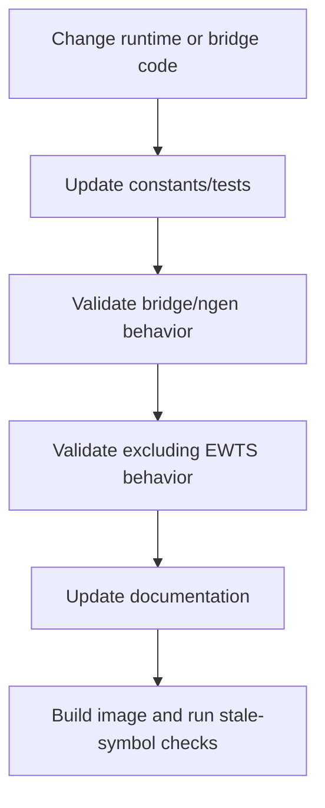

# Developer Guide

This guide is for EWTS maintainers and integrators making changes to the runtime, bridge, or documentation.

## Change principles

| Principle | Guidance |
| --- | --- |
| Preserve cross-language semantics | Any level or status change must be reflected in all runtime bindings. |
| Keep STATUS reliable | Do not let diagnostic filtering suppress STATUS. |
| Avoid hidden global behavior | Prefer explicit EWTS IDs and configuration. |
| Maintain standalone operation | Bridge mode should not be the only usable path. |
| Make image behavior auditable | Preserve build metadata and validation checks. |

## Documentation standards

| Standard | Requirement |
| --- | --- |
| Markdown flavor | GitHub Markdown. |
| Tables | Use GitHub tables only. |
| Diagrams | Use Mermaid where diagrams improve comprehension. |
| Duplication | Link to canonical pages instead of repeating full explanations. |
| Examples | Keep examples implementation-oriented and minimal. |
