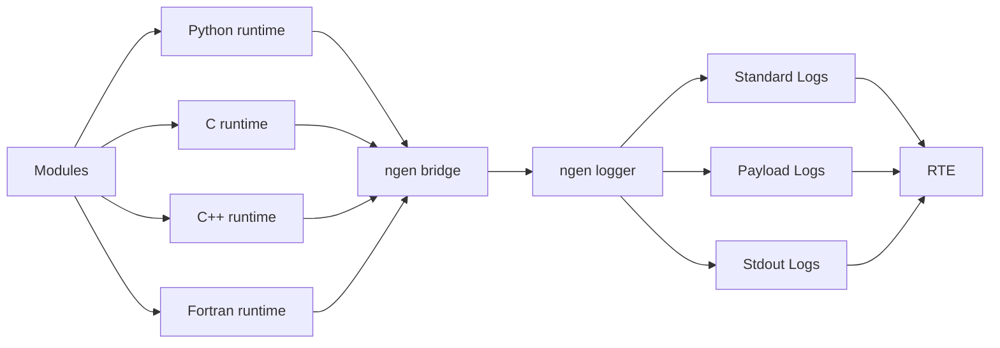

# EWTS Documentation Version 2.1.0

The Error and Warning Trapping System (EWTS) is the shared logging and status-reporting layer used by modules and components throughout the ngen ecosystem. It provides a consistent logging interface for Python, C, C++, and Fortran applications while supporting standalone execution, ngen integration, and Runtime Environment (RTE) deployments.

Version 2.1.0 documents the current implementation and the architectural improvements introduced since the original release. These improvements simplify integration, improve maintainability, and provide consistent logging behavior across all supported languages and execution environments.

This manual replaces the original MkDocs documentation with a cohesive implementation-oriented guide. It preserves the practical navigation structure where possible, removes duplication, and organizes the documentation around how EWTS is built, configured, integrated, operated, and extended.

## Key Version 2.1.0 Improvements
- Removed Python lazy binding, simplifying logger initialization and eliminating deferred runtime configuration.
- Added optional EWTS integration for ngen builds, allowing EWTS support to be enabled or excluded at build time without modifying application code.
- Introduced Payload logging, providing a standardized mechanism for communicating progress and model state to the Runtime Environment (RTE).
- Unified logging behavior across Python, C, C++, and Fortran runtime libraries, ensuring consistent log levels, formatting, and module identification.
- Improved ngen bridge integration, allowing all supported languages to produce consistent EWTS log output through a common interface.
- Simplified standalone operation, providing automatic logging to module-specific log files or standard output when the ngen bridge is unavailable.

## What EWTS provides

| Capability | Purpose |
| --- | --- |
| Centralized logging | Formatting and log file handling controlled by the ngen logger. Modules use the ngen bridge log method. |
| MPI Aware Logging |  Log messages written to per-rank log files |
| Standard log levels | Common numeric severity model across Python, C, C++, and Fortran integrations. |
| Standard log messages | Human readable, timestamped, module, log level identified log messages. |
| Payload log messages | Structured progress and status reporting for RTE-facing machine consumable payload state. |
| Module-scoped logging | Allows standard logs to be unified or split by module EWTS IDs. Payload logs always unified.|
| ngen bridge integration | Routes module log messages through ngen when running with the EWTS ngen bridge. |
| Standalone fallback | Modules write to configured log files or stdout when not running with the EWTS ngen bridge. |
| Multi-language support | Provides integration points for Python, C, C++, and Fortran modules and components. |

## NGEN log message flow

## Recommended reading paths

| Audience | Path |
| --- | --- |
| Model developer | Concepts → Runtime guide → Payload status messages → Examples. |
| ngen integrator | Architecture → ngen Integration → Docker Builds → Troubleshooting. |
| RTE/operator | Configuration → RTE Integration → Validation Checklist. |
| Maintainer | Design Improvements → Developer Guide → API Reference. |
