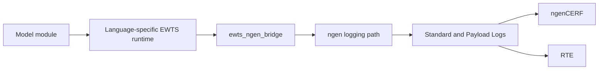

# ngen Integration

The ngen integration connects EWTS-enabled model modules to the ngen logging path. Module code uses the appropriate EWTS runtime library for its language. The EWTS ngen bridge is the integration layer that forwards those messages into ngen when EWTS support is enabled in an ngen build.

## Integration responsibilities

| Component | Responsibility |
| --- | --- |
| EWTS runtime libraries | Provide module-facing logging APIs for Python, C, C++, and Fortran module code. |
| `ewts_ngen_bridge` | Forward EWTS ID, level, and message text into the ngen logging path. |
| ngen logging path | Handle ngen-side formatting, routing, and log-file behavior. |
| RTE | Collect ngen logs and consume payload messages for progress and execution state. |

## Build flags

| Flag | Typical value | Purpose |
| --- | --- | --- |
| `USE_EWTS` | `ON` or `OFF` | Enables or excludes EWTS support in ngen builds. |
| `EWTS_WITH_NGEN` | `ON` | Builds EWTS with ngen bridge support. |
| `EWTS_BUILD_SHARED` | `ON` | Builds shared libraries for runtime loading. |
| `EWTS_REF` | Branch, tag, or commit | Selects the EWTS source version. |
| `EWTS_PREFIX` | `/opt/ewts` | Installation prefix for headers, libraries, and Python artifacts. |

## Runtime behavior

When EWTS support is enabled and the bridge is available, EWTS runtime calls from modules are routed into the ngen logging path. When the bridge is not active, the runtimes support standalone behavior through configured file output or stdout fallback.
