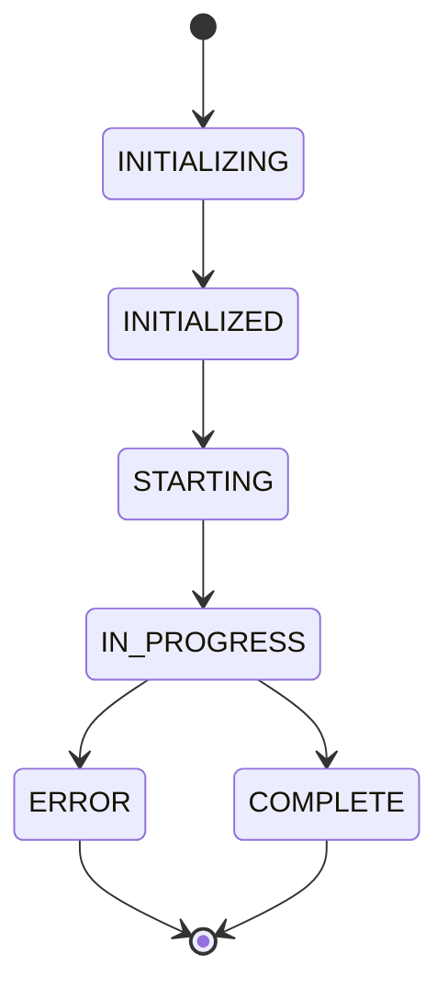

# RTE Integration

RTE consumes EWTS output through the ngen logging pipeline. The most important RTE-facing feature is payload logging, which provides structured progress and execution-state messages in addition to ordinary diagnostic log lines.

## RTE-facing outputs

| Output | Purpose |
| --- | --- |
| Diagnostic log lines | Help developers and operators diagnose model behavior. |
| Payload messages | Communicate initialization, progress, completion, and error state in a structured format. |
| Module IDs | Allow output to be attributed to model modules and supporting components. |
| Run log directory | Stores standalone or collected logs for a specific run. |

## Recommended payload sequence

| Stage | Status | Example message |
| --- | --- | --- |
| Before setup work | `INITIALIZING` | `Initializing BMI module` |
| After setup | `INITIALIZED` | `BMI initialization complete` |
| Before main run | `STARTING` | `Starting model execution` |
| During work | `IN_PROGRESS` | `Running timestep 120` |
| Normal finish | `COMPLETE` | `Model execution complete` |
| Failure | `ERROR` | `Failed to process forcing input` |

## Diagnostic logging versus payload logging

| Logging type | Intended consumer | Content |
| --- | --- | --- |
| Diagnostic logging | Developers and operators | Human-readable messages used for troubleshooting and operational review. |
| Payload logging | RTE and downstream automation | Structured messages wrapped in `<MSG_DATA>` and containing JSON payload fields. |

Status information may appear in ordinary diagnostic logs, often at `INFO` level. Payload logging is separate because it uses structured data intended for machine consumption by RTE.
