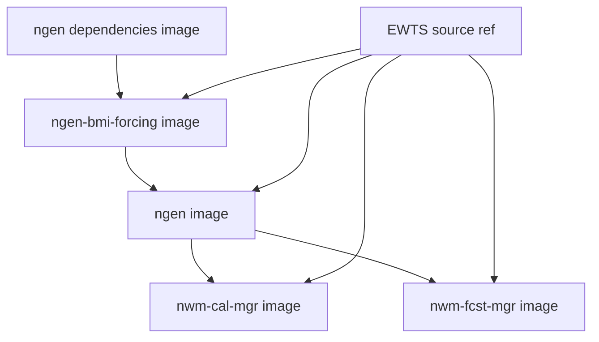

# Docker and Container Builds

Container builds should install a single, known EWTS version and ensure every downstream component uses that same version.

## Build arguments

| Argument | Purpose |
| --- | --- |
| `GH_ORG` | GitHub organization containing the EWTS repository. |
| `GHCR_ORG` | GitHub Container Registry. OCI-compatible registry for storing and distributing Docker and other container images. Images are hosted under the ghcr.io domain. |
| `USE_EWTS` | Enables or disables EWTS build logic. |
| `EWTS_REF` | Branch, tag, or commit for EWTS source. |
| `EWTS_PREFIX` | Installation prefix, usually `/opt/ewts`. |
| `EWTS_CACHE_BUST` | Forces rebuild of EWTS layer when needed. |

## Recommended build steps

| Step | Action |
| ---: | --- |
| 1 | Clone the requested EWTS ref. |
| 2 | Configure with `-DEWTS_WITH_NGEN=ON -DEWTS_BUILD_SHARED=ON`. |
| 3 | Build and install to `/opt/ewts`. |
| 4 | Install the generated Python wheel if Python runtime support is needed. |
| 5 | Record git metadata in the image. |
| 6 | Validate that stale Python symbols are absent. |
