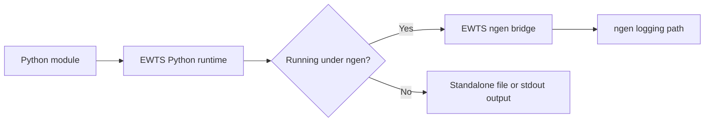

# Python Runtime Guide

The Python runtime provides an idiomatic logger wrapper that supports standard EWTS levels, Payload messages, file/stdout fallback, and ngen bridge routing.

## Intended use

| Use case | Description |
| --- | --- |
| Python module logging | Allow Python modules to emit EWTS diagnostic messages with a module-specific EWTS ID. |
| Consistent EWTS levels | Use the same level semantics as the Python, C, and Fortran runtimes. |
| Payload logging | Allow modules to emit structured payload messages using the documented EWTS payload convention. |
| ngen execution | Route module messages through the EWTS integration path when the module is executed under ngen. |
| Standalone execution | Support module execution outside ngen where logging falls back to configured file output or stdout. |

## Public entry points

| API | Purpose |
| --- | --- |
| `setup_logger()` | Create and configure an EWTS logger for an EWTS ID. Used by components. |
| `configure_existing_logger()` | Adopt a pre-created Python logger and apply EWTS configuration. Used by BMI modules |

## Relationship to the ngen bridge

| Item | Role |
| --- | --- |
| Python Package| Module-facing API used by Ptyhon modules. Imports `ctypes` to call the ewts bridge log method. |
| EWTS ngen bridge | Integration layer that forwards EWTS messages into the ngen logging path. |
| ngen logger | ngen-owned logging infrastructure. |

## Runtime responsibilities

| Responsibility | Description |
| --- | --- |
| Level mapping | Preserve EWTS log-level semantics for C++ module code. |
| Module identity | Include the EWTS ID so messages can be attributed to the correct module. |
| Message forwarding | Pass module messages into the EWTS native logging layer. |
| Payload message support | Allow payload messages to be emitted using the documented `<MSG_DATA>` wrapper and JSON fields. |
| Standalone fallback | Preserve usable output when the ngen bridge is not active. |

## Payload message guidance

C++ modules that report progress or execution state should use the same payload message convention as the other runtimes.

| Field | Default or expectation |
| --- | --- |
| `status` | Payload execution state such as `INITIALIZING`, `IN_PROGRESS`, `COMPLETE`, or `ERROR`. |
| `prog` | Progress value when available. |
| `msg` | Optional human-readable status message. Empty values are allowed. |
| `modnm` | Module name or EWTS ID used by downstream consumers. |

Use a JSON serialization helper rather than manually concatenating JSON field values whenever practical. This prevents malformed payload messages caused by unescaped quotes, embedded newlines, or other special characters.

## When to use `setup_logger()`
Use `setup_logger()` when your component needs to create and configure its own EWTS logger. This is the typical entry point for components that are not executed as ngen modules.

## When to use `configure_existing_logger()`

Use `configure_existing_logger()` when a module already creates a Python `logging.Logger`, and replacing it would break existing code or third-party behavior.

## Version 2 Note: lazy binding removed

The current runtime removed older lazy-binding behavior. Images should not contain `bind_logger`, `is_bound`, or `get_bound_logger` symbols from the old implementation.
